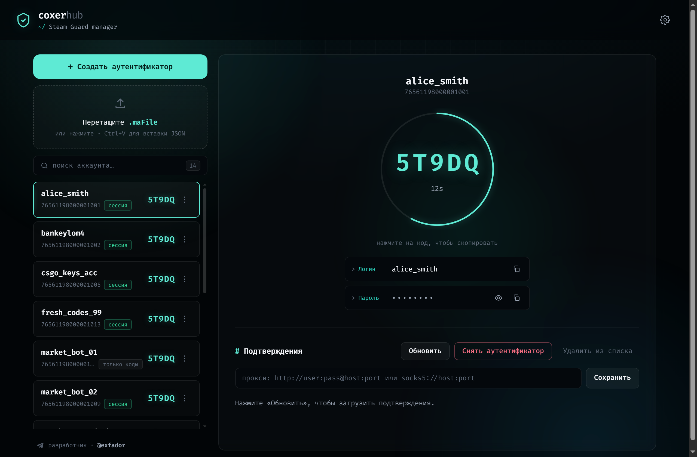

<div align="center">

# Steam Desktop Authenticator — Web · SDA

[](LICENSE)
[](https://nodejs.org)
[](#tech-stack)
[](#quick-start)



</div>

---

<details open>
<summary><b>🇬🇧 English</b></summary>

> **TL;DR** — a web alternative to the classic Windows **Steam Desktop Authenticator (SDA)**.
> Generates Steam Guard 2FA codes, confirms trades/market listings, and can add or remove
> the Steam Guard **mobile authenticator** — all from a local web UI, on Windows, Linux or macOS.

**Keywords:** Steam Guard · Steam Desktop Authenticator · SDA · maFile · mobile authenticator ·
2FA · TOTP · Steam trade confirmations · shared_secret / identity_secret · self-hosted · Node.js.

---

### Features

- **Live Steam Guard codes** — correct Steam TOTP (HMAC-SHA1, 30-second window, Steam's
  base-26 alphabet) with a countdown ring; time is synced to Steam's own clock.
- **Import `.maFile`** — drag & drop, file picker, or paste JSON (`Ctrl+V`). Encrypted SDA
  exports are supported too (PBKDF2-SHA1 + AES-256-CBC) — add the matching `manifest.json`
  to the same import and you'll be asked for the password.
- **Create a new authenticator** — log in with username/password, enter the email Steam Guard
  code, optionally attach a phone number (or stay phone-less with email confirmation). You get
  the **revocation code (R-code)** at the end. The login & password are saved into the `.maFile`.
- **Remove an authenticator** — unlink Steam Guard Mobile using the revocation code.
- **Trade & market confirmations** — list pending confirmations and accept/decline them one by
  one or in bulk.
- **Download the `.maFile`** — right-click an account (or the **⋮** menu) → *Download .maFile*.
- **Login & password at a glance** — shown next to the code, masked by default, with reveal/copy.
- **Search & scroll** — filter accounts by name or SteamID; the list scrolls on its own when you
  have many of them.
- **Per-account or global proxy** — HTTP / SOCKS via `undici` (`COXER_PROXY` / `STEAM_PROXY`).
- **Durable storage** — `.maFile`s live in `./maFiles` with collision-safe filenames, atomic
  writes, and BOM-tolerant parsing; deleting an account moves the file to `./maFiles/.trash`
  instead of erasing it, so nothing is lost across restarts.
- **Polished UI** — terminal-dark theme, animated background, fully responsive (desktop & mobile).
- **One-command deploy** — production [`deploy.sh`](deploy.sh) for Ubuntu (Node + nginx + systemd,
  optional HTTP Basic Auth / UFW / Let's Encrypt TLS).

---

### Quick start

```bash
npm install
npm start
```

Open **http://127.0.0.1:3000**

Requires **Node.js ≥ 18**.

---

### Configuration

All configuration is via environment variables:

| Variable          | Default        | Description                                               |
|-------------------|----------------|-----------------------------------------------------------|
| `PORT`            | `3000`         | HTTP port                                                 |
| `HOST`            | `127.0.0.1`    | Bind address (keep on localhost unless behind a proxy)    |
| `COXER_VAULT_DIR` | `./maFiles`    | Where `.maFile`s are stored                               |
| `COXER_PROXY`     | —              | Global proxy for Steam requests (`STEAM_PROXY` also works)|

---

### REST API

The browser never receives secrets in the account list — the server returns ready-made codes and
public fields only. The raw `.maFile` and credentials are served **only on explicit request**.

| Method & path                            | Purpose                                  |
|------------------------------------------|------------------------------------------|
| `GET  /api/accounts`                     | List accounts (public fields)            |
| `POST /api/accounts/import`              | Import one or more `.maFile`s            |
| `DELETE /api/accounts/:id`               | Remove account (file → `.trash`)         |
| `PATCH /api/accounts/:id`                | Set per-account proxy                    |
| `GET  /api/accounts/:id/code`            | Current Steam Guard code for one account |
| `GET  /api/codes`                        | Codes for all accounts + time sync       |
| `GET  /api/accounts/:id/credentials`     | Login & password (on demand)             |
| `GET  /api/accounts/:id/file`            | Download the raw `.maFile`               |
| `GET  /api/accounts/:id/actions`         | Pending trade/market confirmations       |
| `POST /api/accounts/:id/actions/resolve` | Accept/decline confirmation(s)           |
| `POST /api/accounts/:id/revoke`          | Remove the authenticator (R-code)        |
| `POST /api/enroll/start`                 | Begin creating a new authenticator       |
| `GET  /api/enroll/:id`                   | Enrollment state (polling)               |
| `POST /api/enroll/:id/input`             | Submit a step value (email/SMS code…)    |
| `POST /api/enroll/:id/cancel`            | Cancel enrollment                        |

---

### Tech stack

Pure **Node.js (ESM) + Express** backend, **undici** for proxied Steam requests, and a dependency-free
**vanilla-JS** frontend. No database. Static assets are served straight from `public/`.

| File                 | Responsibility                                              |
|----------------------|-------------------------------------------------------------|
| `server.js`          | Express app & REST API                                      |
| `lib/guardcode.js`   | Steam Guard code generation (`buildCode`)                   |
| `lib/clock.js`       | Steam time sync (`serverClock`)                             |
| `lib/vault.js`       | Parse `.maFile` (`readVault`)                               |
| `lib/blobcrypt.js`   | Decrypt encrypted `.maFile` (PBKDF2 + AES-256-CBC)          |
| `lib/registry.js`    | Profile & `.maFile` storage                                 |
| `lib/actions.js`     | Trade/market confirmation hashing & operations              |
| `lib/signin.js`      | Mobile sign-in (RSA password + Begin/Poll)                  |
| `lib/enroll.js`      | Add authenticator (HasPhone → Add → Finalize)               |
| `lib/enrollflow.js`  | Interactive enrollment state machine                        |
| `lib/revoke.js`      | Remove authenticator by revocation code                     |
| `lib/tokenwire.js`   | Refresh access token from refresh token                     |
| `lib/rpc.js`         | Steam service message schemas & transport (`invokeService`) |
| `lib/wire.js`        | Minimal protobuf codec (`packMessage` / `unpackMessage`)    |
| `lib/netgate.js`     | Proxy dispatcher (HTTP/SOCKS via `undici`)                  |

---

### Deploy (Ubuntu, production)

#### One-line install (recommended)

On a fresh Ubuntu server, just run:

```bash
curl -fsSL https://raw.githubusercontent.com/exfador/steam-desktop-authenticator-web/main/deploy.sh | sudo bash
```

The script bootstraps itself: it installs `git`, downloads the project into `/opt/sda` (creating
folders as needed) and runs the installer. Pass options as environment variables:

```bash
# domain + HTTPS (Let's Encrypt):
curl -fsSL https://raw.githubusercontent.com/exfador/steam-desktop-authenticator-web/main/deploy.sh \
  | sudo DOMAIN=example.com SETUP_TLS=yes TLS_EMAIL=you@mail.com bash
```

Re-running the same command later updates the code and redeploys — your `.maFile`s are untouched.

#### From a clone

```bash
git clone https://github.com/exfador/steam-desktop-authenticator-web.git /opt/sda
cd /opt/sda && sudo bash deploy.sh
```

It installs Node (NodeSource), sets up an **nginx** reverse proxy and a **systemd** service, and
(by default) puts **HTTP Basic Auth** in front of the site. Logs: `journalctl -u coxerhub -f`.

**Useful env vars:** `INSTALL_DIR` (default `/opt/sda`), `BRANCH` (default `main`), `APP_PORT`
(default `3000`), `SETUP_AUTH` / `AUTH_USER` / `AUTH_PASS`, `SETUP_UFW`, `COXER_PROXY`, `VAULT_DIR`.

> ⚠️ Don't run the project from `/root` — the service user can't read it (the installer defaults to
> `/opt/sda` for exactly this reason).

---

### Remote management (VDS / VPS)

You can deploy the app on a VDS server and manage your accounts remotely from any device.

1. Rent any Ubuntu VDS — you will receive a **public IP address**.
2. Run the one-line install from the Deploy section above.
3. After deployment the script prints the site URL, login, and Basic Auth password — **save them**.
4. Open `http://<public-IP>` in a browser from any device — the interface is accessible from the internet.

> For extra security, attach a domain and enable HTTPS:
> `sudo DOMAIN=your.domain SETUP_TLS=yes TLS_EMAIL=you@mail.com bash deploy.sh`

---

### Security

- A `.maFile` contains `shared_secret` and `identity_secret` — **full access to Steam Guard**.
  Treat it like a password.
- By default the server listens on **`127.0.0.1` only**. Do not expose it to the internet without
  **HTTPS and authentication** — the bundled `deploy.sh` adds HTTP Basic Auth for exactly this reason.
- Files in `./maFiles` are stored in plain text; keep the folder private (it's in `.gitignore`).
- The account list never ships secrets to the browser; downloading a `.maFile` or revealing the
  password are explicit, on-demand actions.

---

### License

[**AGPL-3.0**](LICENSE) — see [`LICENSE`](LICENSE) and [`NOTICE`](NOTICE).

This is an independent project and is **not affiliated with, endorsed by, or connected to Valve or Steam**.
"Steam" is a trademark of Valve Corporation.

</details>

---

<details>
<summary><b>🇷🇺 Русский</b></summary>

> **Коротко** — веб-альтернатива классическому Windows-приложению **Steam Desktop Authenticator (SDA)**.
> Генерирует коды Steam Guard, подтверждает трейды и заявки на маркете, умеет добавлять и удалять
> мобильный аутентификатор — всё через браузер, на Windows, Linux или macOS.

---

### Возможности

- **Живые коды Steam Guard** — правильный Steam TOTP (HMAC-SHA1, окно 30 секунд, алфавит Steam base-26)
  с кольцом обратного отсчёта; время синхронизируется с серверами Steam.
- **Импорт `.maFile`** — перетащите файл, выберите через диалог или вставьте JSON (`Ctrl+V`).
  Поддерживаются зашифрованные экспорты SDA (PBKDF2-SHA1 + AES-256-CBC) — добавьте `manifest.json`
  к импорту и вам предложат ввести пароль.
- **Создание нового аутентификатора** — войдите по логину/паролю, введите код из email, при желании
  привяжите номер телефона. В конце вы получите **код восстановления (R-code)**. Логин и пароль
  сохраняются в `.maFile`.
- **Удаление аутентификатора** — отвязка Steam Guard Mobile по коду восстановления.
- **Подтверждения трейдов и маркета** — список активных подтверждений, принятие/отклонение поштучно
  или оптом.
- **Скачать `.maFile`** — правой кнопкой по аккаунту (или меню **⋮**) → *Скачать .maFile*.
- **Логин и пароль рядом** — выводятся рядом с кодом, по умолчанию скрыты, можно раскрыть и скопировать.
- **Поиск и прокрутка** — фильтрация аккаунтов по имени или SteamID; список прокручивается
  автоматически при большом количестве аккаунтов.
- **Прокси на аккаунт или глобальный** — HTTP / SOCKS через `undici` (`COXER_PROXY` / `STEAM_PROXY`).
- **Надёжное хранилище** — `.maFile`-ы лежат в `./maFiles` с безколлизионными именами, атомарными
  записями и BOM-устойчивым парсером; удаление аккаунта перемещает файл в `./maFiles/.trash`,
  ничего не теряется при перезапуске.
- **Стильный интерфейс** — тёмная терминальная тема, анимированный фон, полностью адаптивный
  (ПК и мобильный).
- **Деплой одной командой** — скрипт [`deploy.sh`](deploy.sh) для Ubuntu (Node + nginx + systemd,
  опционально HTTP Basic Auth / UFW / Let's Encrypt TLS).

---

### Быстрый старт

```bash
npm install
npm start
```

Откройте **http://127.0.0.1:3000**

Требуется **Node.js ≥ 18**.

---

### Конфигурация

Все настройки — через переменные окружения:

| Переменная        | По умолчанию   | Описание                                                        |
|-------------------|----------------|-----------------------------------------------------------------|
| `PORT`            | `3000`         | HTTP-порт                                                       |
| `HOST`            | `127.0.0.1`    | Адрес прослушивания (оставьте localhost, если за прокси)        |
| `COXER_VAULT_DIR` | `./maFiles`    | Папка для хранения `.maFile`                                    |
| `COXER_PROXY`     | —              | Глобальный прокси для запросов к Steam (или `STEAM_PROXY`)      |

---

### REST API

Браузер никогда не получает секреты в списке аккаунтов — сервер возвращает только готовые коды
и публичные поля. Сырой `.maFile` и учётные данные отдаются **только по явному запросу**.

| Метод и путь                             | Назначение                                       |
|------------------------------------------|--------------------------------------------------|
| `GET  /api/accounts`                     | Список аккаунтов (публичные поля)                |
| `POST /api/accounts/import`              | Импорт одного или нескольких `.maFile`           |
| `DELETE /api/accounts/:id`               | Удалить аккаунт (файл → `.trash`)                |
| `PATCH /api/accounts/:id`                | Задать прокси для аккаунта                       |
| `GET  /api/accounts/:id/code`            | Текущий код Steam Guard для одного аккаунта      |
| `GET  /api/codes`                        | Коды всех аккаунтов + синхронизация времени      |
| `GET  /api/accounts/:id/credentials`     | Логин и пароль (по запросу)                      |
| `GET  /api/accounts/:id/file`            | Скачать сырой `.maFile`                          |
| `GET  /api/accounts/:id/actions`         | Активные подтверждения трейдов/маркета           |
| `POST /api/accounts/:id/actions/resolve` | Принять/отклонить подтверждения                  |
| `POST /api/accounts/:id/revoke`          | Удалить аутентификатор (R-code)                  |
| `POST /api/enroll/start`                 | Начать создание нового аутентификатора           |
| `GET  /api/enroll/:id`                   | Состояние процесса создания (polling)            |
| `POST /api/enroll/:id/input`             | Передать значение шага (код из email/SMS…)       |
| `POST /api/enroll/:id/cancel`            | Отменить создание аутентификатора                |

---

### Стек технологий

Бэкенд — чистый **Node.js (ESM) + Express**, **undici** для проксированных запросов к Steam,
фронтенд — **vanilla JS** без зависимостей. Без базы данных. Статика раздаётся прямо из `public/`.

| Файл                 | Ответственность                                             |
|----------------------|-------------------------------------------------------------|
| `server.js`          | Express-приложение и REST API                               |
| `lib/guardcode.js`   | Генерация кода Steam Guard (`buildCode`)                    |
| `lib/clock.js`       | Синхронизация времени Steam (`serverClock`)                 |
| `lib/vault.js`       | Парсинг `.maFile` (`readVault`)                             |
| `lib/blobcrypt.js`   | Расшифровка зашифрованного `.maFile` (PBKDF2 + AES-256-CBC) |
| `lib/registry.js`    | Хранение профилей и `.maFile`                               |
| `lib/actions.js`     | Хэширование и операции подтверждений трейдов/маркета        |
| `lib/signin.js`      | Мобильный вход (RSA-пароль + Begin/Poll)                    |
| `lib/enroll.js`      | Добавление аутентификатора (HasPhone → Add → Finalize)      |
| `lib/enrollflow.js`  | Конечный автомат процесса создания аутентификатора          |
| `lib/revoke.js`      | Удаление аутентификатора по коду восстановления             |
| `lib/tokenwire.js`   | Обновление access-токена из refresh-токена                  |
| `lib/rpc.js`         | Схемы сообщений Steam и транспорт (`invokeService`)         |
| `lib/wire.js`        | Минимальный protobuf-кодек (`packMessage` / `unpackMessage`)|
| `lib/netgate.js`     | Диспетчер прокси (HTTP/SOCKS через `undici`)                |

---

### Деплой (Ubuntu, production)

#### Установка одной командой (рекомендуется)

На чистом Ubuntu-сервере выполните:

```bash
curl -fsSL https://raw.githubusercontent.com/exfador/steam-desktop-authenticator-web/main/deploy.sh | sudo bash
```

Скрипт сам себя бутстрапит: устанавливает `git`, скачивает проект в `/opt/sda` и запускает
установку. Параметры передаются через переменные окружения:

```bash
# домен + HTTPS (Let's Encrypt):
curl -fsSL https://raw.githubusercontent.com/exfador/steam-desktop-authenticator-web/main/deploy.sh \
  | sudo DOMAIN=example.com SETUP_TLS=yes TLS_EMAIL=you@mail.com bash
```

Повторный запуск той же команды обновляет код и переразворачивает сервис — `.maFile`-ы не трогаются.

#### Из клона репозитория

```bash
git clone https://github.com/exfador/steam-desktop-authenticator-web.git /opt/sda
cd /opt/sda && sudo bash deploy.sh
```

Скрипт устанавливает Node (NodeSource), настраивает **nginx** как reverse proxy и **systemd**-сервис,
по умолчанию включает **HTTP Basic Auth**. Логи: `journalctl -u coxerhub -f`.

**Полезные переменные:** `INSTALL_DIR` (по умолч. `/opt/sda`), `BRANCH` (по умолч. `main`),
`APP_PORT` (по умолч. `3000`), `SETUP_AUTH` / `AUTH_USER` / `AUTH_PASS`, `SETUP_UFW`,
`COXER_PROXY`, `VAULT_DIR`.

> ⚠️ Не запускайте проект из `/root` — сервисный пользователь не сможет его прочитать
> (установщик по умолчанию использует `/opt/sda` именно по этой причине).

---

### Удалённое управление (VDS / VPS)

Приложение можно поднять на VDS-сервере и управлять аккаунтами удалённо — с любого устройства
и из любой точки мира.

1. Арендуйте любой VDS с Ubuntu — провайдер выдаст вам **публичный IP-адрес**.
2. Выполните установку одной командой из раздела «Деплой» выше.
3. После завершения скрипт выведет адрес сайта, логин и пароль Basic Auth — **сохраните их**.
4. Откройте `http://<публичный-IP>` в браузере с любого устройства — интерфейс доступен из интернета.

> Для защиты трафика рекомендуется привязать домен и включить HTTPS:
> `sudo DOMAIN=ваш.домен SETUP_TLS=yes TLS_EMAIL=вы@почта bash deploy.sh`

---

### Безопасность

- `.maFile` содержит `shared_secret` и `identity_secret` — **полный доступ к Steam Guard**.
  Обращайтесь с ним как с паролем.
- По умолчанию сервер слушает только **`127.0.0.1`**. Не открывайте его в интернет без
  **HTTPS и аутентификации** — именно для этого `deploy.sh` добавляет HTTP Basic Auth.
- Файлы в `./maFiles` хранятся в открытом виде; держите папку закрытой (она в `.gitignore`).
- Список аккаунтов никогда не отдаёт секреты в браузер; скачать `.maFile` или показать пароль —
  это явные действия по запросу пользователя.

---

### Лицензия

[**AGPL-3.0**](LICENSE) — см. [`LICENSE`](LICENSE) и [`NOTICE`](NOTICE).

Независимый проект, **не аффилированный с Valve или Steam**.
«Steam» — торговая марка Valve Corporation.

</details>
